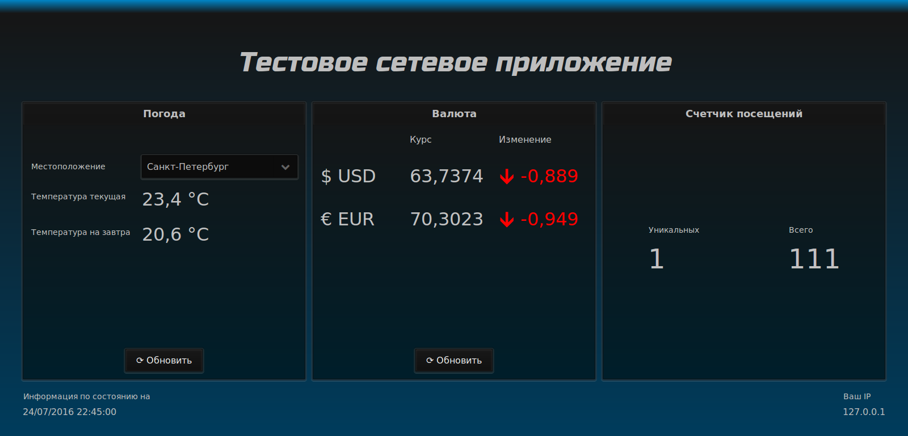

DASHBOARD
=========
ОПИСАНИЕ
--------
Webapp для Tomcat 8. 

Показывает информацию о 
- текущей погоде в 3-ч городах 
(Новосибирск, Москва, Санкт-Петербург)
на сегодня и на завтра
- Курс доллара и евро и его изменение
- Число уникальных посетителей и общее загрузок страницы

СКРИНШОТ
--------

ПОДРОБНОСТИ
-----------

Используется фреймворк Vaadin, реализующий клиент-серверное взаимодействие
и формирование веб-интерфейса

Для хранения IP адресов посетителей используется NoSQL БД MongoDB

Информеры:
- forecast.io (погода)
- [Центробанк России] (cbr.ru) (валюта)

Путь : `http://localhost:8080/dashboard/`

Порт MongoDB по-умолчанию.